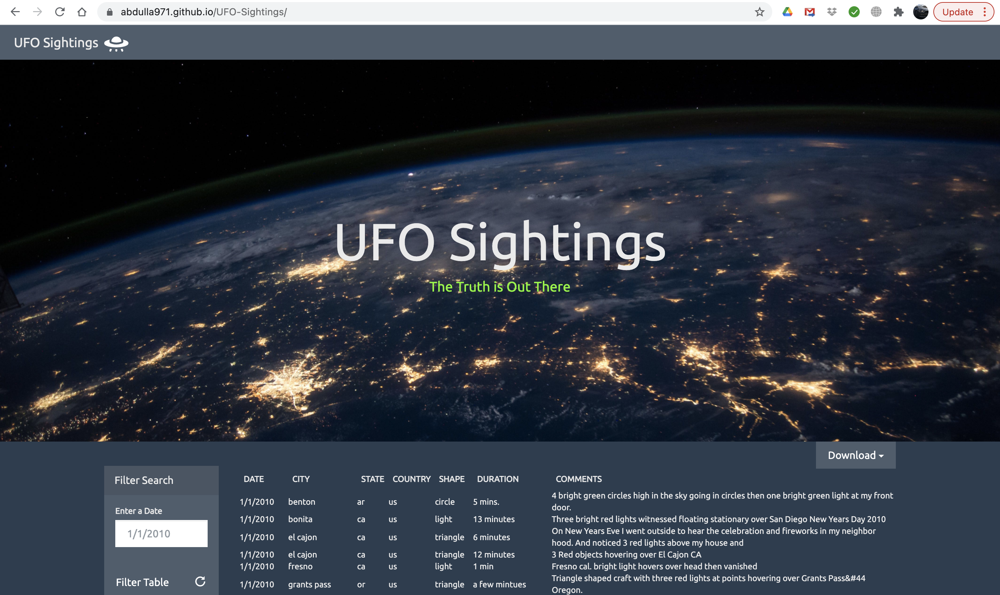

# UFO-Sightings
Created a dynamic table based on the given dataset and a filter was created for specific values. The webpage is created using JavaScript, HTML, and CSS, and D3.js. for UFO sightings, the site can be accessed using this URL: https://abdulla971.github.io/UFO-Sightings/

## Project Purpose

Is to create a dynamic table based upon UFO sightings dataset that will enable users to search and filter the table data for specific values. Utilizing JavaScript, HTML, CSS and D3.js to create our webpage.

## The Challenge Task

### Before You Begin

1. Create a new repository for this project I called it `UFO-Sightings`. **Do not add this homework to an existing repository**.

2. Clone the new repository to your computer.

3. Inside your local git repository, create a directory for the Javascript challenge. Use the folder names to correspond to the challenges: **UFO-level-1** and **UFO-level-2**.

4. Add your **html** files to this folder as well as your static folder containing your javascript. This will be the main script to run for analysis.

5. Push the above changes to GitHub or GitLab.

### Level 1: Automatic Table and Date Search (Required)

* Create a basic HTML web page or use the [index.html](index.html) file provided (we recommend building your own custom page!).

* Using the UFO dataset provided in the form of an array of JavaScript objects, write code that appends a table to your web page and then adds new rows of data for each UFO sighting.

  * Make sure you have a column for `date/time`, `city`, `state`, `country`, `shape`, and `comment` at the very least.

* Use a date form in your HTML document and write JavaScript code that will listen for events and search through the `date/time` column to find rows that match user input.

### Level 2: Multiple Search Categories (Optional)

* Complete all of Level 1 criteria.

* Using multiple `input` tags and/or select dropdowns, write JavaScript code so the user can to set multiple filters and search for UFO sightings using the following criteria based on the table columns:

  1. `date/time`
  2. `city`
  3. `state`
  4. `country`
  5. `shape`

## Preview
Basic site preview:

